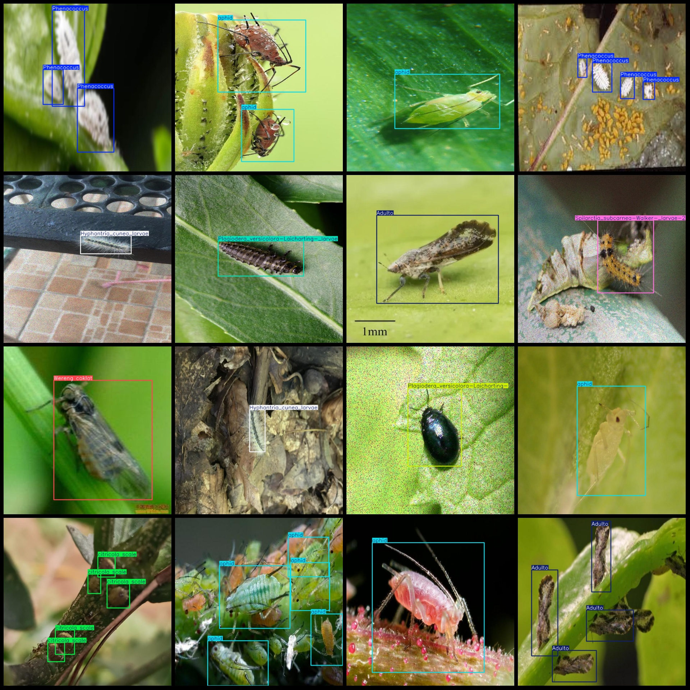
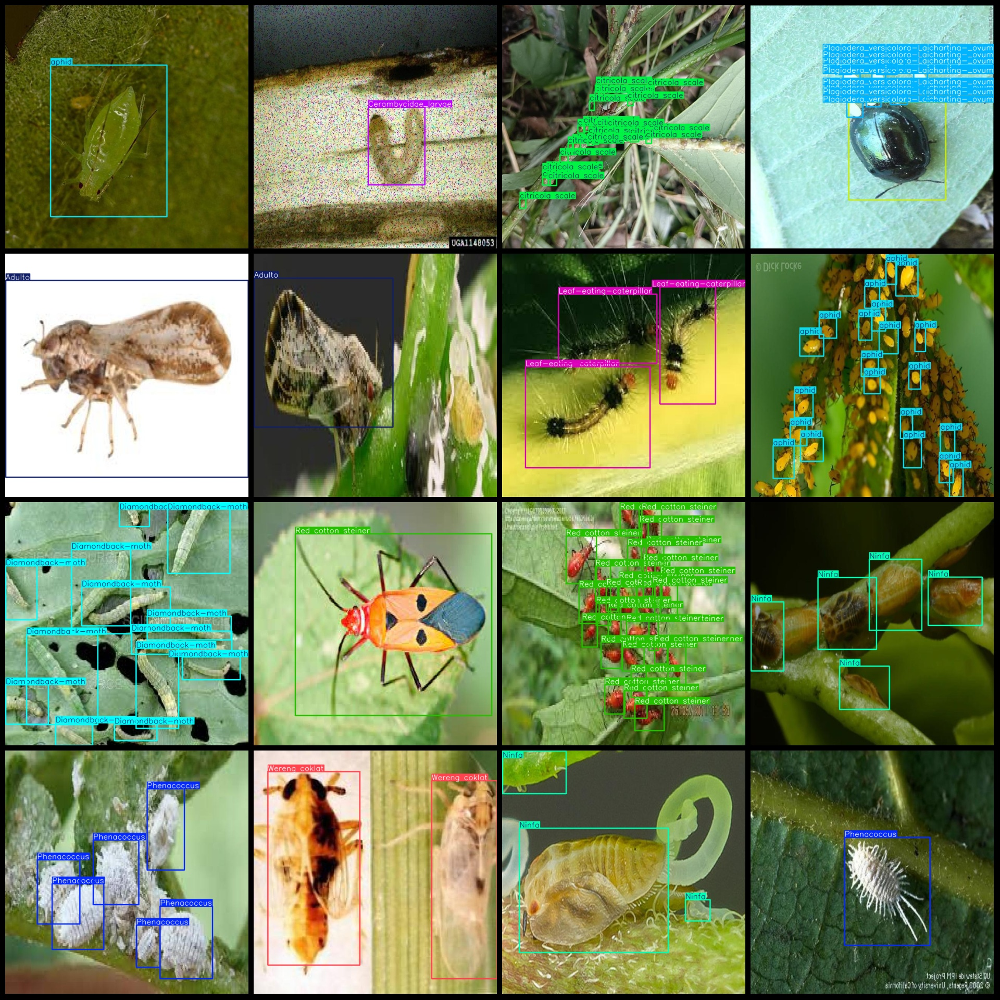

# Agricultural Field Insect Detection Dataset VOC+YOLO Format with 2824 Images and 27 Categories

Dataset format: Pascal VOC format + YOLO format (without split path in txt file, only containing jpg images and corresponding VOC format xml files and yolo format txt files)
Number of images (jpg file count): 2848
Number of annotations (xml file count): 2848
Number of annotations (txt file count): 2848
Number of annotation categories: 27
Annotation category names (note that the order of categories in the yolo format does not correspond with this, but is based on the labels folder's classes.txt): ["Adulto", "Black-Grass-Caterpillar", "Cerambycidae_larvae", "Cnidocampa_flavescens-Walker_pupa-", "Coconut-black-headed-caterpillar", "Cricket"]
"Diamondback-moth","Drosicha_contrahens_female","Erthesina_fullo_nymph-2","Grasshopper","Hyphantria_cunea_larvae","Hyphantria_cunea_pupa","Latoia_consocia_Walker_larvae","Leaf-eating-caterpillar",
"Micromelalopha_troglodyta-Graeser-_larvae","Ninfa","Ovo","Phenacoccus","Plagiodera_versicolora-Laicharting-","Plagiodera_versicolora-Laicharting-_larvae","Plagiodera_versicolora-Laicharting-_ovum",
"Red cotton steiner","Sericinus_montela_larvae","Spilarctia_subcarnea-Walker-_larvae-2","Wereng coklat","aphid","citricola scale"]  
boxes per class:   
Adulto box count = 563
Black-Grass-Caterpillar box count = 37
Cerambycidae_larvae box count = 94
Cnidocampa_flavescens-Walker_pupa box count = 62
Coconut-black-headed-caterpillar box count = 171
Cricket box count = 335
Diamondback-moth box count = 262
Drosicha_contrahens_female box count = 197
Erthesina_fullo_nymph-2 box count = 230
Grasshopper box count = 238
Hyphantria_cunea_larvae box count = 162
Hyphantria_cunea_pupa box count = 84
Latoia_consocia_Walker_larvae box count = 214
Leaf-eating-caterpillar box count = 244
Micromelalopha_troglodyta-Graeser-_larvae box count = 65
Ninfa box count = 535
Ovo box count = 567
Phenacoccus box count = 1528
Plagiodera_versicolora-Laicharting- box count = 217
Plagiodera_versicolora-Laicharting-_larvae box count = 226
Plagiodera_versicolora-Laicharting-_ovum box count = 334
Red cotton steiner box count = 339
Sericinus_montela_larvae box count = 42
Spilarctia_subcarnea-Walker-_larvae-2 box count = 56
Wereng coklat box count = 890
aphid box count = 2565
citricola scale box count = 550
total boxes: 10807  
image resolution: 640x640  
Annotation Tool: labelImg
Annotation Rule: Draw a rectangle around the class.
Important Notes: There are no specific notes at this time.
Special Statement: This dataset does not guarantee the accuracy of the trained model or the weight file.
Image Preview:
## Images

Here is a pay link on Stripe ( https://buy.stripe.com/3cs8yP7sY87d0vu9AB ). Please contact me lonlonago@foxmail.com after funding $89, and I will send you a complete data files , thank you!

